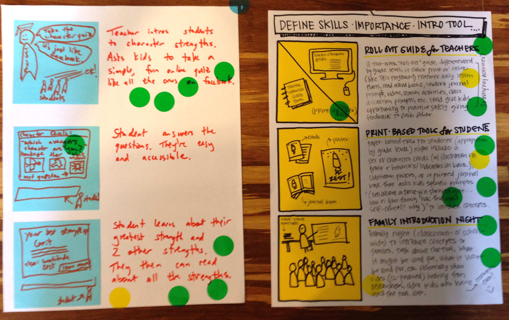
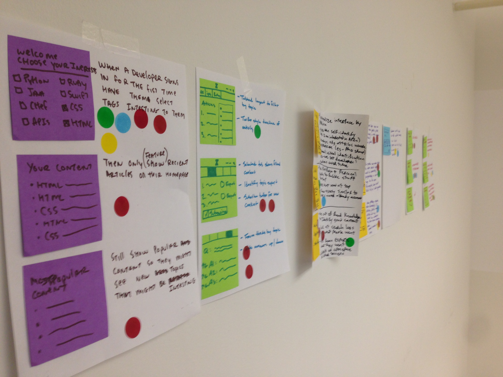
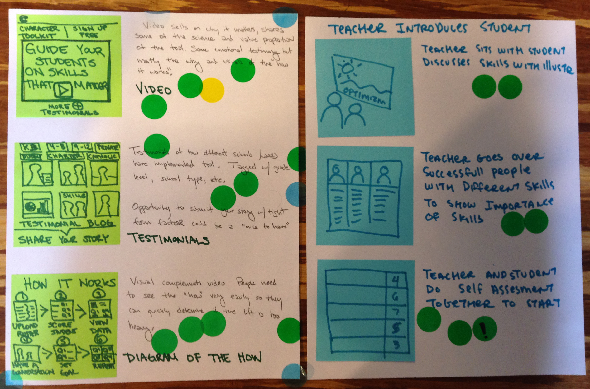

# Storyboards

**Supplies needed:** Blank computer paper, Post-its, Sharpie

**Estimated time:** 20 min

## Best to use when

Storyboards are great to use when the group has had some time to think
individually about the problem and many possible solutions to it. Storyboards
allow people to develop those early ideas further by giving them more time to
dive into details of the interaction.

They are part of the [Google Ventures
Diverge](http://www.gv.com/lib/the-product-design-sprint-divergeday2)
day cycle along with
[Mind Mapping](mind-mapping.md),
[Crazy Eights](crazy-eights.md),
[Silent Critique](silent-critique.md).

## Instructions:

> The goal is to take the ideas we’ve generated so far and sketch an actual UI
showing how a user would move through this part of the story — where they click,
what info they enter, what they think, etc.

From [The product design sprint: diverge (day 2)](http://www.gv.com/lib/the-product-design-sprint-divergeday2)

1. Start with a blank sheet of paper
and put 3 sticky notes
going down the side of the page.
2. Choose an idea that you had previously from another exercise 
like [Mind Mapping](mind-mapping.md)
or [Crazy Eights](crazy-eights.md)
to put more thought and detail into.
2. Each sticky note is one frame in the storyboard.
The sticky note should be
used to draw the action that is happening.
Use the room on the paper to the
side of the Post-it to give a brief explanation.
Make sure that each frame is understandable without further verbal explanation.
3. Fill in each frame in the storyboard.
4. Give the storyboard a title that encapsulates what is happening.
5. Hang each story board on the wall with tape or a pin.
6. Have either a Silent Critique, a Group Critique or both.

## Examples

