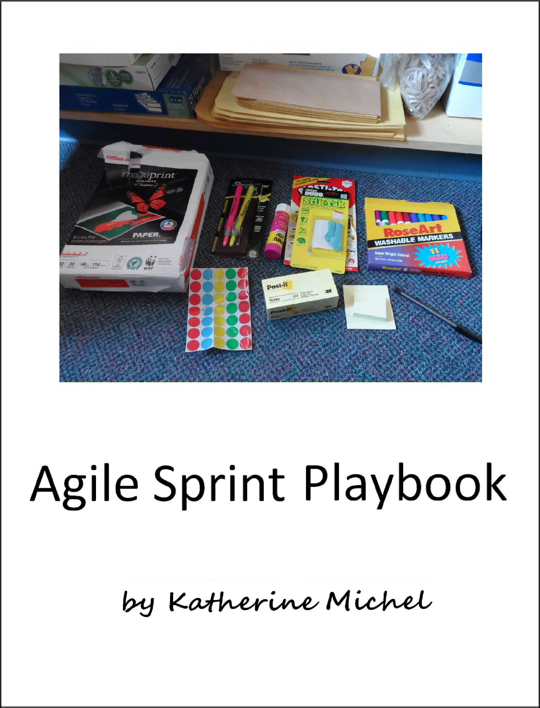

# Agile Sprint Playbook

A GitBook Documenting My Agile Sprint Playbook (Project Management, Research, Design, Development)

Table of Contents
* [About](README.md)
* [Introduction](introduction.md)
* [Scrum Body of Knowledge](scrum-body-of-knowledge/scrum-body-of-knowledge.md)
* [Google Ventures Research and Design Sprint Methodology](google-ventures/google-ventures-research-and-design-sprint-methodology.md)
    * [Google Ventures Research Sprint Methodology](google-ventures/google-ventures-research-sprint-methodology.md)
    * [Google Ventures Design Sprint Methodology](google-ventures/google-ventures-design-sprint-methodology.md)
    * [Google Ventures User Testing Methodology](google-ventures/google-ventures-user-testing-methodology.md)
* [Google Design Sprint](google/google-design-sprint.md)
* [Thoughtbot Design Sprint Methodology](thoughtbot/thoughtbot-design-sprint-methodology.md)
    * [0 Pre-Sprint](thoughtbot/0-pre-sprint.md)
    * [Pre-Sprint Client Worksheet](thoughtbot/0-pre-sprint-client-worksheet.md)
    * [Pre-Sprint Request for Materials](thoughtbot/0-pre-sprint-request-for-materials.md)
    * [Example Schedule](thoughtbot/example-schedule.md)
    * [1 Understand](thoughtbot/1-understand.md)
    * [2 Diverge](thoughtbot/2-diverge.md)
    * [3 Converge](thoughtbot/3-converge.md)
    * [4 Prototype](thoughtbot/4-prototype.md)
    * [5 Test](thoughtbot/5-test.md)
        * [Test Sprint Summary](thoughtbot/5-test-sprint-summary.md)
    * [Previous Sprints Template](thoughtbot/previous-sprints-template.md)
* [U.S. Gov](us-gov/us-gov.md)
* [U.K. Gov](uk-gov/uk-gov.md)
   * [Agile Project Management](uk-gov/agile-project-management.md) 
   * [Service Design Phases](uk-gov/service-design.md)   
* [Australian Gov](australian-gov/australian-gov.md)
   * [Agile Project Management](australian-gov/agile-project-management.md) 
* [New Zealand Gov](new-zealand-gov/new-zealand-gov.md)
* [Usability Gov](usability-gov/usability-gov.md)
   * [Project Management and Development](usability-gov/project-management-and-development.md)
   * [Usability Study Process and Materials Checklist](usability-gov/usability-study-process-and-materials-checklist.md)
   * [Planning Document Templates](usability-gov/planning-document-templates.md)
   * [Questions to Ask at Kickoff Meetings](usability-gov/questions-to-ask-at-kickoff-meetings.md)
   * [Persona Development Discussion Guide](usability-gov/persona-development-discussion-guide.md)
   * [Report Template Content](usability-gov/report-template-content.md)
* [Nielson Norman](nielson-norman/nielson-norman.md)
* [IDEO](ideo/ideo.md)
* [Appendix](appendix/appendix.md)      
    * [Launch Checklists](appendix/launch-checklists.md)
    * [Research Sprint Methods Summary](appendix/research-sprint-methods-summary.md)
    * [Design Sprint Methods Summary](appendix/design-sprint-methods-summary.md)
    * [User Research Data Gathering Methods](appendix/user-research-data-gathering-methods.md)
    * [Survey Question Examples](appendix/survey-question-examples.md)
    * [Business Model Canvas](business-model-canvas/business-model-canvas.md)
    * [S-1 Components](appendix/s-1-components.md) 
    * [Example Demographics](appendix/example-demographics.md)
    * [Branded Documents](appendix/branded-documents.md)
    * [Advertising Methods](appendix/advertising-methods.md)
    * [Research and Design Sprint Examples](appendix/research-and-design-sprint-examples.md)

GitBook: http://katherinemichel.gitbooks.io/agile-sprint-playbook/content/
  
GitHub Repo: https://github.com/KatherineMichel/agile-sprint-playbook

© [Katherine Michel](https://twitter.com/katimichel) 2015-2016
