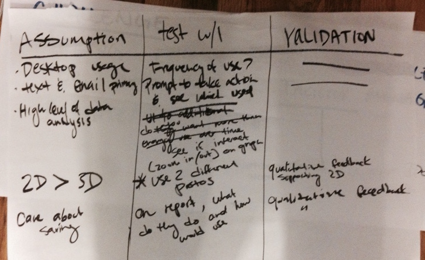

# Assumptions / Test Board
**Supplies needed:** Whiteboard, Markers, Post-its

**Estimated time:** 30 minutes

## Best to use when

It is best to always keep track of the assumptions
that you and your team are making about
your product through the life of the product.
During the product sprint this should be done throughout all phases.
It is best to analyze and figure out how to test the assumptions
during Converge.

## Instructions:

1. Have a dedicated space to collect Assumptions on the whiteboard.
* Throughout the sprint have everyone write down assumptions
that they are making or that they hear other people making
and put them up on the whiteboard.
* At the end of Converge, create a table with 3 columns:
Assumption, Test, Validated if.
* List out all of the assumptions that team is making.
* For each assumption decide how you plan on testing
to see if the assumptions are valid or not
and how you know if that assumption is valid.
* Repeat till all assumptions have a test for them.

## Example

From [The Product Design Sprint](http://robots.thoughtbot.com/the-product-design-sprint)

Assumption Test Example

