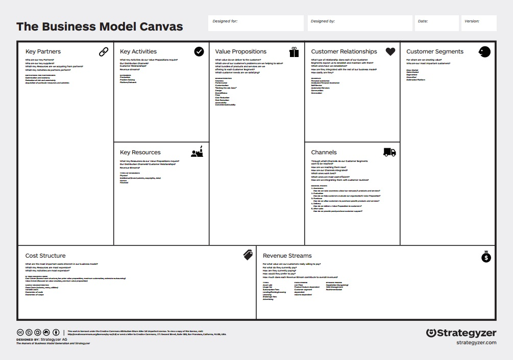

# Business Model Canvas

   * [Business Model Canvas](http://businessmodelgeneration.com/downloads/business_model_canvas_poster.pdf)

* Value Propositions
* Customer Segments
* Customer Relationships
* Key Partners
* Key Activities
* Key Resources
* Cost Structure
* Revenue Streams
* Channels

# Lean Customer Development

# Lean Startup and Launchpad

[Financial and Ops Timeline](http://steveblank.com/?attachment_id=8996)

*   [Scientific Method Wikipedia](http://en.wikipedia.org/wiki/Scientific_method)
*   [Eric Ries: The Lean Startup Principles](http://theleanstartup.com/principles), [Lean Startup Wikipedia](http://en.wikipedia.org/wiki/Lean_Startup), [The Lean Startup Wikipedia](http://en.wikipedia.org/wiki/The_Lean_Startup), [Google Books](http://books.google.com/books?id=tvfyz-4JILwC&printsec=frontcover#v=onepage&q&f=false)
*   [Harvard Business Review: Why the Lean Startup Changes Everything](https://hbr.org/2013/05/why-the-lean-start-up-changes-everything/ar/1)
*   [Eric Ries: Minimum Viable Product Wikipedia](http://en.wikipedia.org/wiki/Minimum_viable_product) 
*   [Brant Cooper and Patrick Vlaskovits: Lean Entrepreneur](http://leanentrepreneur.co)
*   [Steve Blank: Startup Owner's Manual](http://www.amazon.com/Startup-Owners-Manual-Step---Step/dp/0984999302)
*   [Steve Blank: Lean Launchpad Udacity](https://www.udacity.com/course/how-to-build-a-startup--ep245)
*   [Steve Blank: Customer Development Check List](https://docs.google.com/document/d/1rTzXvz8iz1IgiwCipuLaWFXt7yvoTc73blHMpD2Hp50/edit#heading=h.v628ypevulas)
*   [Steve Blank: Competitive Analysis Petal Diagram](http://steveblank.com/2013/11/08/a-new-way-to-look-at-competitors), [Steve Blank: Competitive Analysis Petal Diagram Slideshare](http://www.slideshare.net/sblank/competitive-analysis-petal-diagram), and [Tomasz Tunguz: Why The Petal Diagram Isn't The Best Competition Diagram For Startup's Pitch](http://tomtunguz.com/ecosystem-vs-competition)
*   [Alex Osterwalder: Business Model Generation](http://businessmodelgeneration.com) and [Strategyzer](https://strategyzer.com)
*   [Alex Osterwalder: Business Model Generation Book](http://businessmodelgeneration.com/book), [Business Model Generation Canvas](http://www.businessmodelgeneration.com/canvas/bmc), [Business Model Generation Canvas Poster](http://www.businessmodelgeneration.com/downloads/business_model_canvas_poster.pdf), and [Business Model Canvas Wikipedia](http://en.wikipedia.org/wiki/Business_Model_Canvas) 
*   [Alex Osterwalder: Value Proposition Design Book](https://strategyzer.com/value-proposition-design), [Value Proposition Canvas](http://businessmodelgeneration.com/canvas/vpc) and [Value Proposition Canvas Poster](http://businessmodelgeneration.com/downloads/value_proposition_canvas.pdf)
*   [Business Model Fiddle](http://bmfiddle.com)

Spinoffs
*   [Elevator Canvas Intro](https://medium.com/minimum-viable-canvas/the-elevator-canvas-658a4c74b08d) and [Elevator Canvas Template](https://d262ilb51hltx0.cloudfront.net/max/800/1*Xb0NFBKokCd5DQHKub0SIg.png)  
*   [Jobs to Be Done Framework](https://strategyn.com/customer-centered-innovation-map)
*   [Lean Canvas](https://leanstack.com/LeanCanvas.pdf)  
*   [Minimum Viable Brand Canvas](http://media.leanbrandbook.com/sz-1060x-mvb_canvas_post_graphic.jpg) 
*   [Minimum Viable Canvas Resources](https://medium.com/minimum-viable-canvas), [Minimum Viable Canvas Intro](https://medium.com/@santoshrajan/the-minimum-viable-canvas-6ee9ea072f65), [Using the Minimum Viable Canvas](https://medium.com/minimum-viable-canvas/using-the-minimum-viable-canvas-fae7e027cafc), [Minimum Viable Canvas Template](https://d262ilb51hltx0.cloudfront.net/max/800/1*PlhNZAMQxiuwPN7TsRV20g.png), and [Minimum Viable Canvas Example](https://d262ilb51hltx0.cloudfront.net/max/800/1*gk40wStd6F-3GkGKO8M_wA.png) 
*   [Product Market Fit Storyboard GitHub](https://github.com/TriKro/product-market-fit-storyboard)
*   [Social Lean Canvas](http://socialleancanvas.com/the-canvas) 
*   [Value Proposition Canvas](http://www.peterjthomson.com/2013/11/value-proposition-canvas)