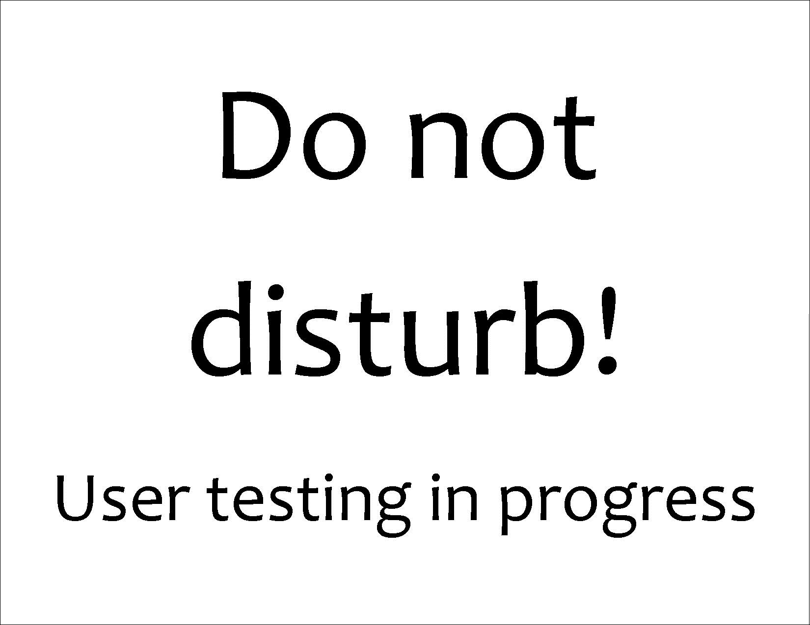
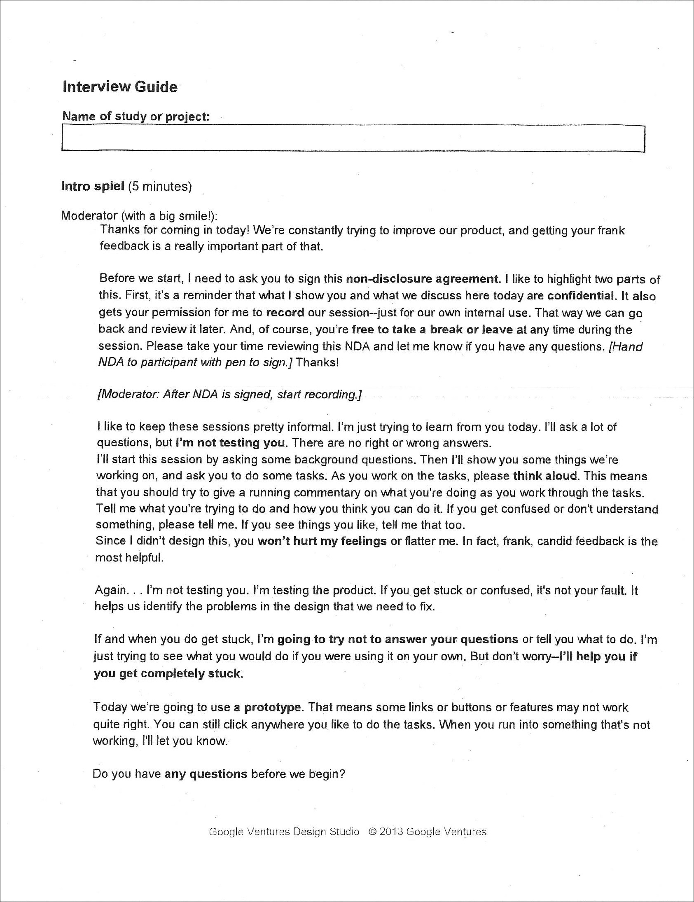
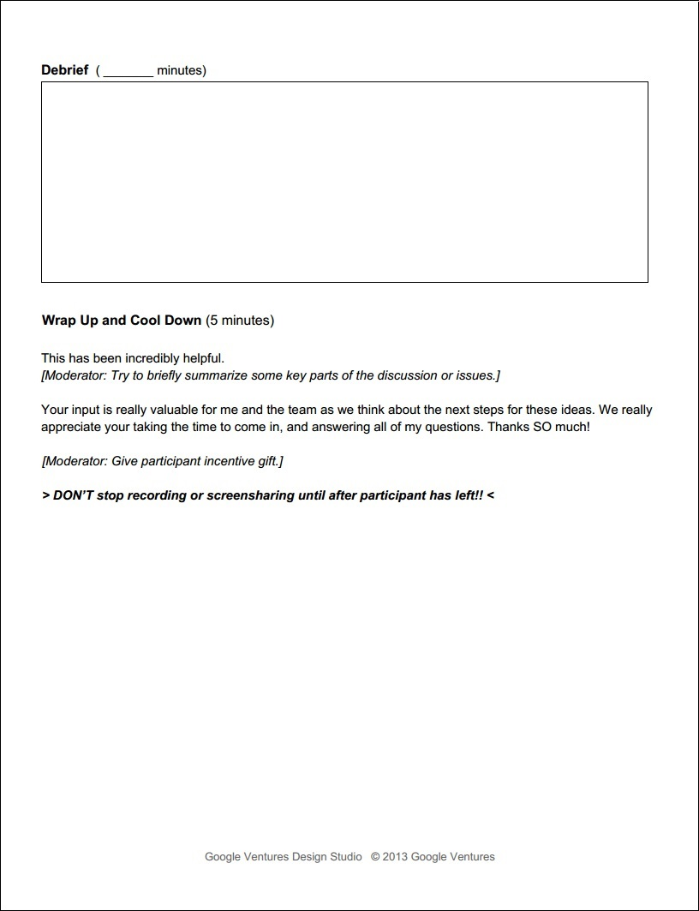

# Combination

# Design Sprint

## People and Supplies

### People 
Only need 1 person; Optionally, include:
* Facilitator
* Designer
* CEO (buy-in/decision-maker)
* Product manager
* User expert 
* Engineer
* Marketer
* Anybody else who’s interested

### [Supplies Needed](http://amzn.com/lm/RS9AYY6BTLDCM)
* Paper
* Sticky notes 
* Drawing pens 
* Whiteboard
* Whiteboard markers
* Dot stickers (for voting)
* Sticky stuff
* Timer 
* Snacks 

* And a working space  

## GV Day 1: Understanding Day
1. Research and Analysis
2. Lightening Demos

## thoughtbot Day 1: Understanding Day

* The Problem Statement
* Start an Assumptions Board
* Start an Back-burner Board
* Pitch Practice
* Existing research
* Definitions: The problem, The Value Prop, Success
* Business Model Canvas
* Lightning Demos
* Expert Perspectives

## Activities

* Gather existing knowledge, expose assumptions and unknowns
* Needs / Wants / Desires
* [Five Whys](http://www.gamestorming.com/games-for-problem-solving/the-5-whys).
* [Who / What / Where / When](http://www.gamestorming.com/games-for-any-meeting/help-me-understand)
* Critical Path
* Open Card Sorting

## GV Day 2: Diverge Day
1. Divide up user story
2. Take notes "how might we" (5 minutes) 
3. Mind map (10–15 minutes)
4. Crazy Eights (5 minutes)
5. Storyboard (10–20 minutes)
6. Silent critique (5–10 minutes)
7. Three-minute critiques (3 minutes per idea)
8. Super vote (5 minutes)
9. Repeat

## thoughtbot Day 2: Diverge Day

* Pitch Practice
* Recap Day 1, identify biggest risks, determine goals for the prototype
* Identify and diagram the critical path for the prototype

#### Diverge Cycle (2 hours)

* Mind Mapping
* Crazy Eights
* Storyboard
* Silent critique
* Group critique
* Repeat Diverge Cycle 

### Additional Activities

* Have a mindset of "Yes and"
* Constantly ask “How might we?”
* 3-12-3

## GV Day 3: Decide Day

1. Discussion and consensus
2. Whiteboard the user story

## thoughtbot Day 3: Converge Day

* Pitch Practice
* Revisit our risks
* Recap Day 2, identify themes from our storyboards
* Identify conflicts in our storyboards
* List the underlying assumptions
* Storyboard your prototype 
* Determine prototype medium 
* Plan interview questions 
* Make plans for reducing risks not addressed by the prototype 
* Consider plans for the week following the design sprint 

### Activities

* Identify Conflicts
* Assumption / Test Table
* Back Burner Board
* Final Storyboard
* 3-12-3

## GV Day 4: Prototype Day

1. The storyboard from the previous day is used to make a prototype for user testing interviews 

## thoughtbot Day 4: Prototype Day

### Activities

* HTML & CSS
* [Invision](http://www.invisionapp.com)
* [Keynote](https://www.apple.com/mac/keynote)
* [Keynotopia](http://keynotopia.com)
* Paper Prototype

## thoughtbot Day 5: Validate Day

* User Interviews 
* Consolidate Notes 
* Write Sprint Summary 

### Activities
* Assumption /
Test table
* Gorilla Usability Testing
* Closed Card Sorting
* Survey Test
* Fake landing page

# GV User Testing Methodology

## User Recruiting Process

## Recruiting Screener Worksheet

I fill out the Google Ventures [Recruiting Screener Worksheet](http://www.gv.com/wp-content/uploads/2014/07/Google-Ventures-Research-Sprint-Screener-Worksheet.pdf) to prepare for user recruitment

## Recruiting Screener
I use [Google Forms](https://support.google.com/docs/answer/87809?hl=en) to create the Recruiting Screener. The results are automatically collected in a spreadsheet in Google Drive. 

## Recruiting Screener Ad
Google Ventures often uses a [Craig's List ad](http://www.gv.com/wp-content/uploads/2014/07/Google-Ventures-Research-Sprint-Sample-Craigslist-ad.png) with a link to the Recruiting Screener to recruit users. Alternatively, I have sent an email ad with a link to the Recruiting Screener to members of a mailing list.

## Contacting Prospective Users

### Phone Call
After reviewing the Recruiting Screener responses automatically collected in a spreadsheet in Google Drive, I choose prospective user testing participants and call each one to confirm participation. 

### Follow Up Email

After the phone calls, I send each confirmed participant a follow up email. In each email I include:

* Date
* Time
* Directions
* Contact info
* NDA (if needed)
* A request that prospective users reply to confirm

Google Ventures suggests including in the email a link to a non-disclosure agreement ([Google Ventures Example Non-Disclosure Agreement](http://www.gv.com/wp-content/uploads/2014/07/Google-Ventures-Research-Sprint-Sample-NDA.pdf)). 

## User Interviews

The user testing interviews are done using the prototype that was the end result of the Design Sprint. 

### Interview Guide 

I use Google Ventures ["User Research, Quick 'n' Dirty,"](http://www.gv.com/wp-content/uploads/2013/02/User-Research-Workshop_Google-Ventures_Feb2013.pdf) as an interview planning resource.

#### Example Use Case

### User Testing Summary Report

## Metrics

### HEART/Goals-Signals-Metrics Framework

Example [HEART/Goals-Signals-Metrics](https://www.gv.com/lib/how-to-choose-the-right-ux-metrics-for-your-product) chart from Google Ventures

### Sprint Summary
* Where we came from
* What we got to
* Major learnings/take aways
* Where to go next

