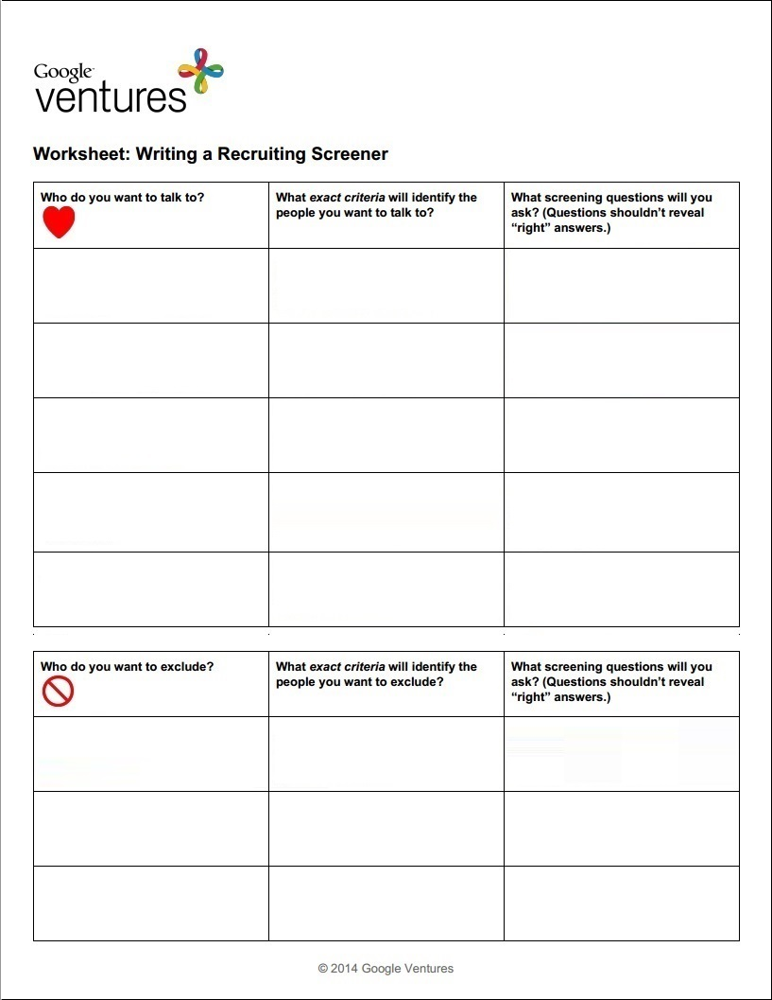
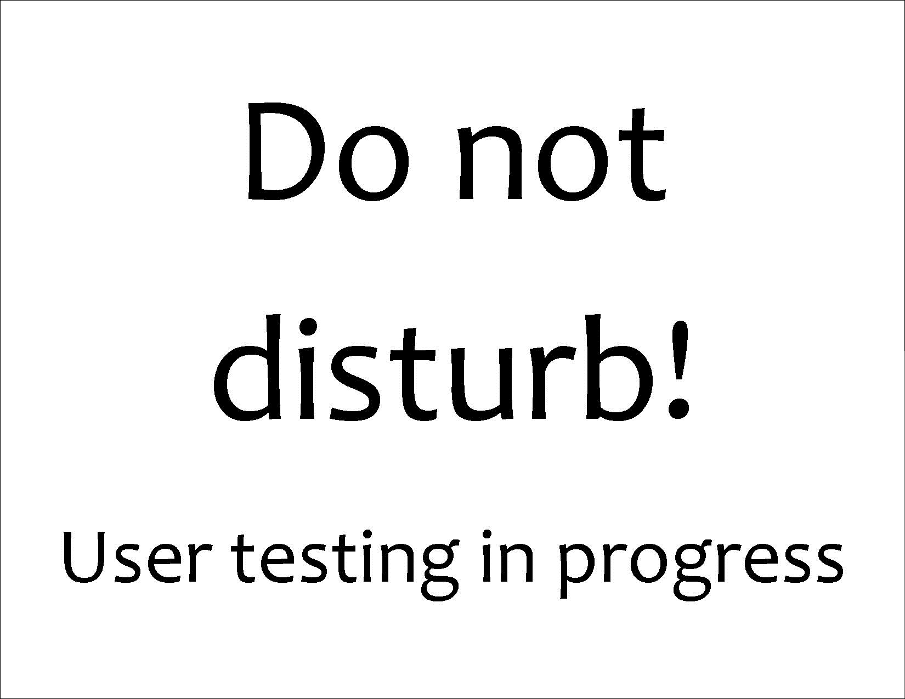
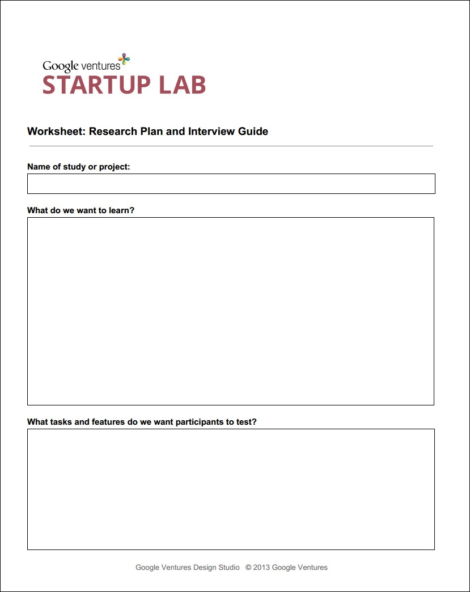
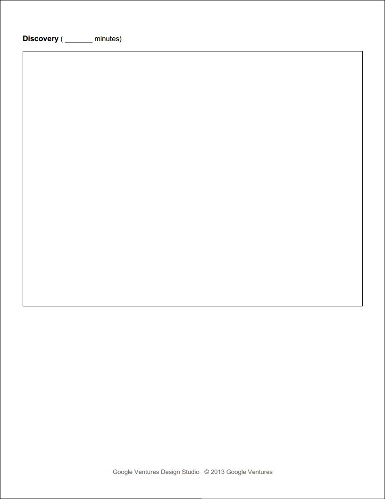
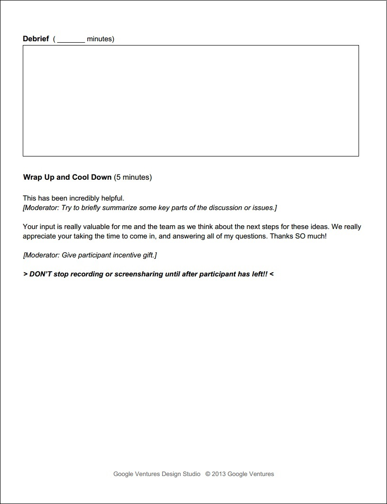
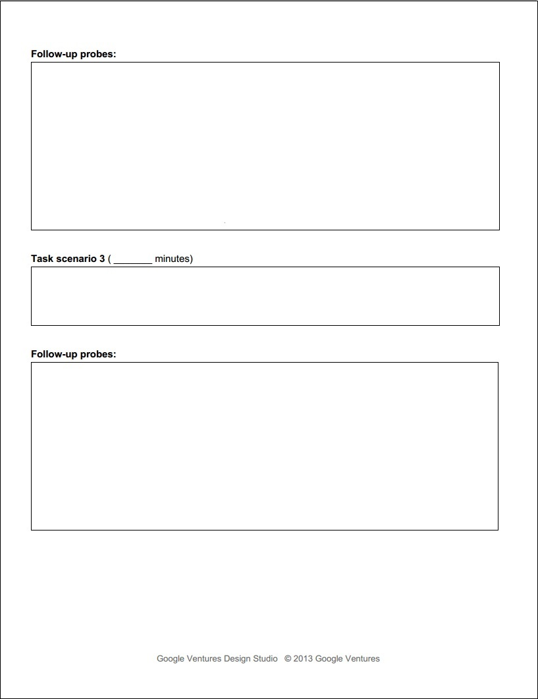
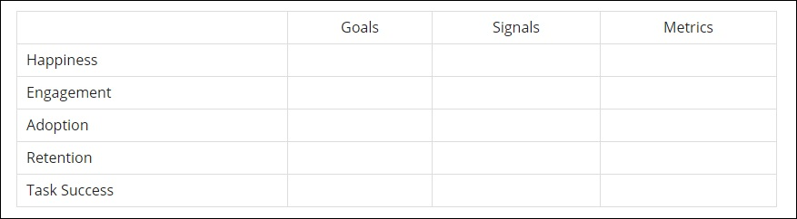

# Google Ventures User Testing Methodology

## User Recruiting Process

## Recruiting Screener Worksheet

I fill out the Google Ventures [Recruiting Screener Worksheet](https://www.dropbox.com/s/5kmofdms00sbh84/Google-Ventures-Research-Sprint-Screener-Worksheet.pdf) to prepare for user recruitment

## Recruiting Screener
I use [Google Forms](https://support.google.com/docs/answer/87809?hl=en) to create the Recruiting Screener. The results are automatically collected in a spreadsheet in Google Drive. 

## Recruiting Screener Ad
Google Ventures often uses a [Craig's List ad](http://www.gv.com/wp-content/uploads/2014/07/Google-Ventures-Research-Sprint-Sample-Craigslist-ad.png) with a link to the Recruiting Screener to recruit users. Alternatively, I have sent an email ad with a link to the Recruiting Screener to members of a mailing list.

## Contacting Prospective Users

### Phone Call
After reviewing the Recruiting Screener responses automatically collected in a spreadsheet in Google Drive, I choose prospective user testing participants and call each one to confirm participation. 

### Follow Up Email

After the phone calls, I send each confirmed participant a follow up email. In each email I include:

* Date
* Time
* Directions
* Contact info
* NDA (if needed)
* A request that prospective users reply to confirm

Google Ventures suggests including in the email a link to a non-disclosure agreement ([Google Ventures Example Non-Disclosure Agreement](http://www.gv.com/wp-content/uploads/2014/07/Google-Ventures-Research-Sprint-Sample-NDA.pdf)). 

## User Interviews

The user testing interviews are done using the prototype that was the end result of the Design Sprint. 

### Interview Guide 

I use Google Ventures ["User Research, Quick 'n' Dirty,"](http://www.gv.com/wp-content/uploads/2013/02/User-Research-Workshop_Google-Ventures_Feb2013.pdf) as an interview planning resource.

#### Example Use Case

### User Testing Summary Report

## Metrics

### HEART/Goals-Signals-Metrics Framework

Example [HEART/Goals-Signals-Metrics](https://www.gv.com/lib/how-to-choose-the-right-ux-metrics-for-your-product) chart from Google Ventures

