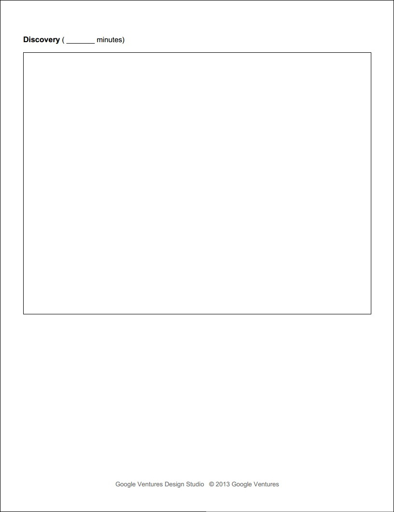
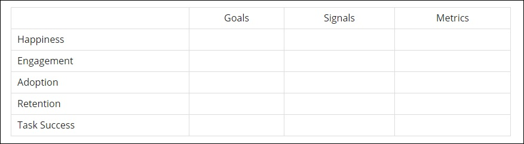

# GV User Testing Methodology

## User Recruiting Process

## Recruiting Screener Worksheet

I fill out the Google Ventures [Recruiting Screener Worksheet](http://www.gv.com/wp-content/uploads/2014/07/Google-Ventures-Research-Sprint-Screener-Worksheet.pdf) to prepare for user recruitment

## Recruiting Screener Ad
Google Ventures often uses a [Craig's List ad](http://www.gv.com/wp-content/uploads/2014/07/Google-Ventures-Research-Sprint-Sample-Craigslist-ad.png) to recruit users. Because members of the United Methodist Church would be the primary users, I sent an email ad to members of the congregation with a link to the [Recruiting Screener](https://docs.google.com/forms/d/16BgZQXq5FDxPuzamTADUWCKCPkizIKzR7now_lNrozM/viewform?usp=send_form). 

Email Ad with link to [Recruitment Screener](https://docs.google.com/forms/d/16BgZQXq5FDxPuzamTADUWCKCPkizIKzR7now_lNrozM/viewform?usp=send_form)

## Recruiting Screener
I used [Google Forms](https://support.google.com/docs/answer/87809?hl=en) to create a [Recruiting Screener](https://docs.google.com/forms/d/16BgZQXq5FDxPuzamTADUWCKCPkizIKzR7now_lNrozM/viewform?usp=send_form). The results are automatically collected in a spreadsheet in Google Drive. 

## Contacting Prospective Users

### Phone Call
After reviewing the Recruiter Screener responses automatically collected in a spreadsheet in Google Drive, I choose prospective user testing participants and call each one to confirm participation. 

### Follow Up Email

After the phone calls, I send each confirmed participant a Follow Up Email. In each email I include:

* Date
* Time
* Directions
* Contact info
* NDA (if needed)
* A request that prospective users reply to confirm

Example Follow Up Email

Google Ventures suggests including in the email a link to a non-disclosure agreement ([Google Ventures Example Non-Disclosure Agreement](http://www.gv.com/wp-content/uploads/2014/07/Google-Ventures-Research-Sprint-Sample-NDA.pdf)). 

## User Interviews

The user interviews would be done using the [Prototype](prototype.md) that was the end result of my Design Sprint. 

### Interview Guide 

I use Google Ventures ["User Research, Quick 'n' Dirty,"](http://www.gv.com/wp-content/uploads/2013/02/User-Research-Workshop_Google-Ventures_Feb2013.pdf) as an interview planning resource.

#### Example Use Case

### User Testing Summary Report

## Metrics

### HEART/Goals-Signals-Metrics Framework

Example [HEART/Goals-Signals-Metrics](https://www.gv.com/lib/how-to-choose-the-right-ux-metrics-for-your-product) chart from Google Ventures

## Research Sprint Day 4 (~8 hours)

Conduct User Study
Interview participants and summarize findings 

* Set up the observation room
* Set up test devices and recording system.
* Test desktop prototypes
* Test mobile prototypes
* Prepare your team to watch the interviews
* Get into character
* Showtime: Interview five customers!
* Summarize findings, review and plan next steps with your team.

"Your interviews will help you answer big questions, test your assumptions, and figure out what to do next."

Set up the room
Before participants arrive, use this checklist to prepare:

* Print copies of the non-disclosure agreement (in case participants did not e-sign).
* Print your interview guide (for your reference).
* Clean up the interview room: erase whiteboards, throw out empty coffee cups, etc.
* Post “do not disturb” sign on the door of the room.
* Gather incentives for participants (gift cards, etc).
* Grab a notepad and pens for any short notes you want to take. (But your team will handle the bulk of the notetaking.)
* Make sure there’s a clock on the wall or table.
Put a box of tissues in the room, just in case.

Testing desktop prototypes

* Test video streaming and recording.
* If using GoToMeeting, schedule a “meeting” for each interview. Add the meeting URLs and phone numbers to your team’s calendar.
* Install the prototypes and do a test run. (Be sure to revert prototypes to their default state before the interviews.)
* Hide obvious personal information and remove desktop icons from computer. (desktop only)
* Clear web browser history, cookies, cache, and bookmarks.
* Create bookmarks or shortcuts for prototypes.
* Set an innocuous home page (e.g. your local newspaper). (desktop only)
* Minimize the browser or prototypes until you’re ready for your participants to test them. 
* Wipe down the keyboard, mouse, and display.

In addition to the above, for Testing mobile prototypes

* Close the browser or prototypes until you’re ready for your participants to test them.
* Open the IPEVO Presenter app on the computer.
* Position the Ziggi document camera so it’s focused on the test device.
* Position the webcam so it’s focused on the participant’s face.

Prepare your team to watch the interviews

* Grab plenty of snacks and drinks so they don’t have to step out during the interviews.
* Test the audio and video before the interviews begin.
* Mute their microphone (and video camera, if necessary) so participants don’t get nervous about being watched.
* Assign one note-taker to write detailed, transcript-style notes — and rotate so no one is stuck typing for five hours!
* Stock up on Post-It notes, notepads, pens, and whiteboard markers.
* Pay attention and write down observations, insights, and ideas during the interviews.
* Keep laptops closed and phones put away during the interviews.
* Collect insights and ideas after each interview, so it doesn’t all pile up at the end of the day.
* Have fun and keep an open mind!
* Design Sprint Day 5: Validate

Before the first session: List your key questions

"Review your conflicts and assumptions."

"Are you testing multiple prototypes in a battle royale?"

"Consider showing participants some real products for comparison — they’re like free prototypes!"

Test the A/V ahead of time
Don’t diss the user
Every observer takes notes
Designate a court reporter
Make a scoreboard

"Observing humans: the emotional roller coaster"

First session: “We’re geniuses!” or “We’re idiots!”
Sessions 2–4: “Oh, this is complicated…”

Studies 5-6: “There’s a pattern!”

"Now make two lists on the whiteboard: “things that work” and “problems to solve.”"

How to start your next sprint

A. Most stuff worked

"What to do next: Tune your existing prototype and keep going. Try starting your next sprint at step 3 (decide)."

B. Some big questions

"Mixed bag: a few hits, a few tweaks, and a couple of real head-scratchers"

"You can move fast on the tweaks, but you’ll want to come up with multiple solutions for the bigger problems. Start your next sprint at step 2 (diverge)."

C. Everything exploded

"Start your next sprint back at the drawing board with step 1 (understand). (Hint: the results of this study are perfect fodder for reviewing and building understanding as a group.)"

"A clear list of what to do next"

