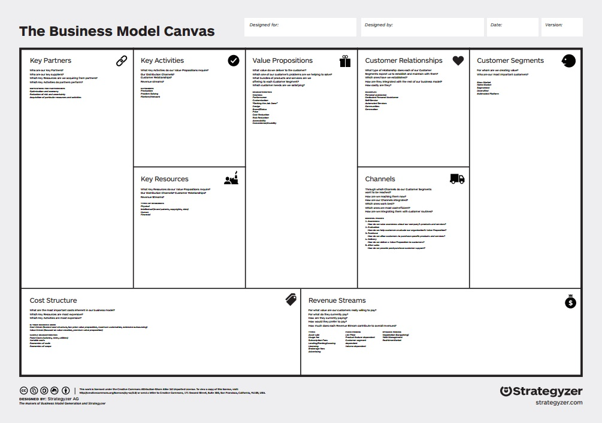

# Business Model Canvas

* [Business Model Canvas](http://businessmodelgeneration.com/downloads/business_model_canvas_poster.pdf)

* Value Propositions (What do you do?)
* Customer (Audience) Segments (Who do you help?)
* Key Partners (Who will help you?)
* Key Activities (How do you do it?)
* Key Resources (What do you need?)
* Distribution Channels (How do you reach them?)
* Customer (Audience) Relationships (How do you interact?)
* Cost Structure (What will it cost?)
* Revenue Streams (How much will you make?)

### Value Proposition
* What value will people get from this product?

### Customer Segments
* Who are your customers or who do you expect them to be?
* Define distinctive customer types (day to day users)
* For customer segment #1, 2, 3...

Customer Analysis

### Customer Influence

Customer Influence Map

Influencers, Recommenders
* List those who could influence a customer’s buying decision

"Economic Buyers" (The person whose budget pays for it)
* Does the economic buyer already have budget for product
* Does budget need to be approved?

"Decision Makers"* 
* Person who can kill purchase (for example by not approving budget)

Potential Saboteurs

### Key Partners
* List key partners (target/necessary) 
* What they will provide
* What company will give in return ("value exchange")

### Partner Types
* Strategic alliances
* Joint new business efforts
* Coopetition
* Key suppliers
* Traffic partners

### Key Activities

### Key Resources
* List key resources (critical to success)
* How will company find/secure
* Identify key resource costs

### Key Resources Types

* Physical resources
* Financial resources
* Human resources
* Intellectual property
* Other key resources

Dependency analysis

### Distribution Channels
* Distribution Channel Diagram
* Distribution Channel Plan
* Channel Responsibility Map
* “Food Chain” Drawing
* Channel Partner's Business Model Drawing

Customer impact
* Will your product create network effects?
* Does it have organic demand versus requiring marketing spend?

### Cost Structure and Revenue Streams

Costs
* One Time Costs
* Ongoing Costs

Revenue Streams
* Pricing Tactics options
* Revenue Model Options

Business Model, Financial Model

Pricing Tactics options
* Value pricing
* Competitive pricing
* Volume pricing
* Portfolio pricing
* Razor/razor blade model
* Subscription
* Leasing
* Freemium

Revenue model options
* Sales
* Subscriptions
* Pay-per-use
* Referral
* Affiliate

Market Analysis
* Overall market knowledge
* Market map

Market Type (Different funding needs for different market types)
* Existing
* Resegmented
* New
* Clone

Market size estimate
* TAM or Total Available market
* SAM or Served Available Market
* Target Market

Market Share estimate

Multi-sided Market
Learn how other side works, buys, how to optimize, how to address each side of the market, other distribution channel, create sales roadmap, create two problem presentations for multi-sided markets

Verify Product/Market Fit

## Charts
* Users, Buyers, Channels
* Company Organizational Chart

* Short Narrative in Bullets (Longterm Company/Product Vision/Strategy)

* "Gathering Forces: Facts that will shape this product/service"
* Valuable articles, notes and other info
* What do we already know? (the facts)
* What do we need to know more about and “how might we” find it out?
* [add questions to the ‘risks’ doc]
  
[Financial and Ops Timeline](http://steveblank.com/?attachment_id=8996)

## Strategic Analysis

Strategic Analysis
* [SWOT Wikipedia](http://en.wikipedia.org/wiki/SWOT_analysis)
* [PEST Analysis](http://en.wikipedia.org/wiki/PEST_analysis)
* [Porter's Five Forces Wikipedia](http://en.wikipedia.org/wiki/Porter_five_forces_analysis)

* PESTLIED
* ANSOF
* Strategic Groups
* Resource-Based Approach
* N-Step
* Prescriptive
* Kaleidoscope
* Kant
* Kotter
