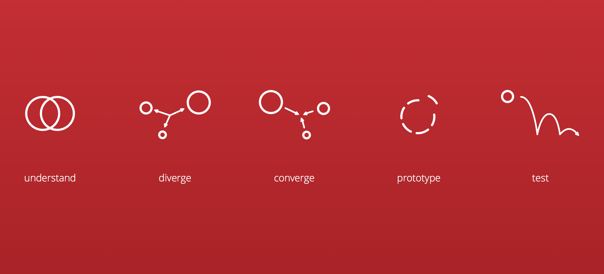

# Thoughtbot Design Sprint Methodology

* [Design Sprint Book](http://www.designsprintbook.com), [Design Sprint Book Amazon](http://www.amazon.com/gp/product/1491923172/ref=olp_product_details?ie=UTF8&me=), and [How to conduct a Design Sprint](http://radar.oreilly.com/2015/05/how-to-conduct-a-design-sprint.html)

* [Thoughtbot's Product Design Sprint Blog Post](http://robots.thoughtbot.com/the-product-design-sprint)
* [Thoughtbot's DIY Design Sprints Blog Post](https://robots.thoughtbot.com/diy-design-sprints)
* [Thoughtbot Playbook](http://playbook.thoughtbot.com/#product-design-sprint)
* [Thoughtbot Playbook Design Sprint](http://playbook.thoughtbot.com/#product-design-sprint)
* [Thoughtbot Design Sprint- Materials GitHub](https://github.com/thoughtbot/design-sprint)
* [Template for finding people on Craigslist](https://gist.github.com/croaky/1a1ff3902b4321984b0b) and [A simple consent form](https://gist.github.com/croaky/bf97025689b019293f78), and [NDA](https://thoughtbot.com/documents/thoughtbot-mutual-nda.pdf)
* [Thoughtbot Design Sprint- iOS Coaching](https://robots.thoughtbot.com/ios-coaching-product-design-sprint)

* [Basecamp: A Shorthand for Designing UI Flows](https://signalvnoise.com/posts/1926-a-shorthand-for-designing-ui-flows)

# Product Design Sprint

This is a collection of documents intended to help guide a design sprint.
It contains guidelines that should not be followed exactly.
Each sprint should be tailored to the individual project.
It is written by and for the thoughtbot team.

* [Previous Sprints](thoughtbot/previous-sprints.md)
* [Pre-Sprint Preparation](0-pre-sprint.md)
* [Understand Phase](1-understand.md)
* [Diverge Phase](2-diverge.md)
* [Converge Phase](3-converge.md)
* [Prototype Phase](4-prototype.md)
* [Test Phase](5-test.md)

## What is a product design sprint?

A product design sprint is a technique to quickly solve product design problems and test the viability of a solution. It has been pioneered by the [Google Ventures Design Team](http://www.gv.com/sprint).

#### Why do a design sprint?

A design sprint orients the team and aims our efforts toward a mutual goal. Design thinking and product design sprints keep us on target and invest our time and money wisely.

Sprints are useful when kicking off a new business, product, feature, or workflow. Sprints can also be used to solve problems with an existing product.

#### What should you expect to have at the end of a design sprint?

At the end of the sprint, the team will understand the problem and will have validated whether we have a viable solution to begin building or whether we need to run another sprint to keep searching for a solution.

## Design Sprint Overview

A design sprint is comprised of five phases; Understand, Diverge, Converge, Prototype and Test. Each phase typically lasts one day.

#### [Pre-Sprint](0-pre-sprint.md)

We should not start a sprint without defining a "job to be done" as the focus of the sprint. The "job to be done" may evolve during the sprint into a problem statement agreed upon by the whole team, but without one as a starting point our client is not ready and should not be paying us.

#### [Understand Phase](1-understand.md)

The Understand phase develops a common understanding of the context within which we are working and all the elements in that context: the customer, their job to be done, and the business our client hopes to support by servicing the job to be done. We want to expose risky knowledge gaps and assumptions so we can make plans to reduce those risks and move forward with confidence.

#### [Diverge Phase](2-diverge.md)

The Diverge phase generates insights and concepts for solutions. Our goal is to explore as many possibilities as possible,
regardless of how feasible or viable. Insights are born from this explosion of possibilities by considering the implications of radically different approaches to solving a problem. These insights can become valuable differentiating forces and the source of inspiration for unique solutions.

#### [Converge Phase](3-converge.md)

The Converge phase takes all the possibilities generated over the past two phases and hones in on a single version to prototype and test with existing or potential customers. By exploring and eliminating so many options, we have reason to be more confident in our choices.

#### [Prototype Phase](4-prototype.md)

The Prototype phase develops a prototype that fills our riskiest knowledge gaps and assumptions. Paper prototypes, Keynote prototypes, Flinto prototypes, and static HTML/CSS pages are all valid mediums. The medium should be determined by our time constraints and learning goals.

#### [Test Phase](5-test.md)

The Test phase tests our prototype with existing or potential customers. By the end of this phase, we should have validated or invalidated our riskiest knowledge gaps and assumptions and have confidence in our next steps.

## [Design Sprint Trello Template](https://trello.com/b/lMmuSlkP/public-design-sprint-template)

Throughout the sprint you want to be recording as much as possible.  We've found Trello to be an excellent tool to help the team record the activities taken during the sprint. This template helps alleviate some of the initial setup for the board and leaves references to this repo.

Copy [this template](https://trello.com/b/lMmuSlkP/public-design-sprint-template) to your own board to help guide and document your sprint.

## Credits

## License

Copyright © 2015 [Thoughtbot, inc](http://thoughtbot.com). The information contained in Design Sprint is free, and may be redistributed under the terms specified in the [license](LICENSE.md).

